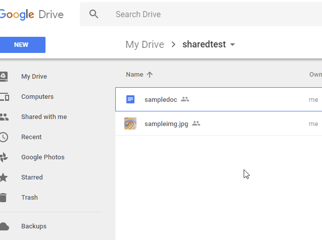

goodls
=====

# Overview
This is a CLI tool to download shared files from Google Drive.

# Demo

The image used for this demonstration was created by [k3-studio](https://k3-studio.deviantart.com/art/Chromatic-spiral-416032436)

# Description
We have already known that the shared files on Google Drive can be downloaded without the authorization. But when the size of file becomes large (about 40MB), it requires a little ingenuity to download the file. It requires to access 2 times to Google Drive. At 1st access, it retrieves a cookie and a code for downloading. At 2nd access, the file is downloaded using the cookie and code. I created this process as a CLI tool. This tool has the following features.

- Use suitable process for size and type of file.
- Retrieve filename and mimetype from response header.
- Can download all shared files except for project files.

# How to Install
Download an executable file of goodls from [the release page](https://github.com/tanaikech/goodls/releases) and import to a directory with path.

or

Use go get.

~~~bash
$ go get -u github.com/tanaikech/goodls
~~~

# Usage
You can use this just after you download or install goodls. You are not required to do like OAuth2 process.

~~~bash
$ goodls -u [URL of shared file on Google Drive]
~~~

- **Help**
    - ``$ goodls --help``
- **Options**
    - ``-e``
        - Extension of output file. This is for only Google Docs (Spreadsheet, Document, Presentation). Default is ``pdf``.
        - Sample :
            - ``$ goodls -u https://docs.google.com/document/d/#####/edit?usp=sharing -e txt``
    - ``-f``
        - Filename of file which is output. When this was not used, the original filename on Google Drive is used.
        - Sample :
            - ``$ goodls -u https://docs.google.com/document/d/#####/edit?usp=sharing -e txt -f sample.txt``
- **URL is like below.**
    - In the case of Google Docs (Spreadsheet, Document, Slides)
        - ``https://docs.google.com/spreadsheets/d/#####/edit?usp=sharing``
        - ``https://docs.google.com/document/d/#####/edit?usp=sharing``
        - ``https://docs.google.com/presentation/d/#####/edit?usp=sharing``
    - In the case of except for Google Docs
        - ``https://drive.google.com/file/d/#####/view?usp=sharing``

## File with URLs
If you have a file including URLs, you can input the URL data using standard input and pipe as follows. If wrong URL is included, the URL is skipped.

~~~bash
$ cat sample.txt | goodls
~~~

or

~~~bash
$ goodls < sample.txt
~~~

**sample.txt**

~~~
https://docs.google.com/spreadsheets/d/#####/edit?usp=sharing
https://docs.google.com/document/d/#####/edit?usp=sharing
https://docs.google.com/presentation/d/#####/edit?usp=sharing
~~~

**When you download shared files from Google Drive, please confirm whether the files are shared.**

# Q&A
- I want to download **shared projects** from user's Google Drive.
    - You can download **shared projects** using [ggsrun](https://github.com/tanaikech/ggsrun).
    - ggsrun can also download **shared files** from other user's Google Drive using Drive API which needs the access token.

-----

# Licence
[MIT](LICENCE)

# Author
[Tanaike](https://tanaikech.github.io/about/)

If you have any questions and commissions for me, feel free to tell me.

# Update History
* v1.0.0 (January 10, 2018)

    1. Initial release.

* v1.0.1 (January 11, 2018)

    1. In order to download several files, a datafile including URLs using Standard Input and Pipe have gotten to be able to be inputted.

* v1.0.2 (May 10, 2018)

    1. Files with large size has gotten to be able to be used.
        - In order to download files with large size (several gigabytes), files are saved by chunks.

[TOP](#TOP)
