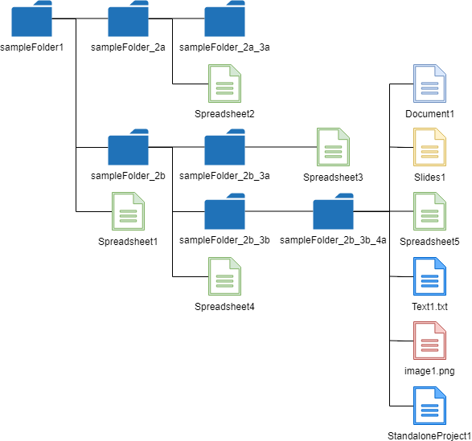
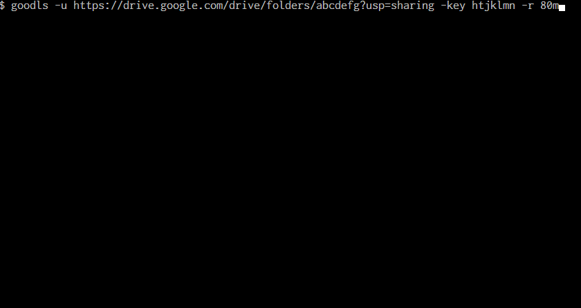

# goodls

<a name="top"></a>
[](LICENCE)

<a name="overview"></a>

# Overview

This is a CLI tool to download shared files and folders from Google Drive. For large file, the resumable download can be also run.

<a name="description"></a>

# Methods

### 1. [Download shared files from the shared URL without the authorization.](#downloadsharedfiles)

We have already known that the shared files on Google Drive can be downloaded without the authorization. But when the size of file becomes large (about 40MB), it requires a little ingenuity to download the file. It requires to access 2 times to Google Drive. At 1st access, it retrieves a cookie and a code for downloading. At 2nd access, the file is downloaded using the cookie and code. I created this process as a CLI tool.

### 2. [Download all shared files with the folder structure from the shared folder.](#downloadfilesfromfolder)

**This method uses API key.**

There are sometimes the situation for downloading files in a shared folder. But I couldn't find the CLI applications for downloading files in the shared folder. So I implemented this. But when in order to retrieve the file list from the shared file, Drive API is required to be used. In order to use Drive API, it is required to use OAuth2, Service account and API key. So I selected to use API key which is the simplest way. This CLI tool can retrieve the file list in the shared folder using API key and download all files in the shared folder. From [version 1.2.2](#v122), you can retrieve only files with the specific mimeType from the folder.

### 3. [Run resumable download for large files.](#resumabledownloadoffile)

**This method uses API key.**

At [a recent proposal](https://github.com/tanaikech/goodls/issues/3), I knew the requirement of the resumable download of shared file. So I implemented this.

# How to Install

Download an executable file of goodls from [the release page](https://github.com/tanaikech/goodls/releases) and import to a directory with path.

or

Use go get.

```bash
$ go install github.com/tanaikech/goodls@latest
```

- `GO111MODULE=on`

# Usage

<a name="downloadsharedfiles"></a>

## 1. Download shared files

<a name="demo1"></a>


The image used for this demonstration was created by [k3-studio](https://k3-studio.deviantart.com/art/Chromatic-spiral-416032436)

<a name="demo2"></a>


You can use this just after you download or install goodls. You are not required to do like OAuth2 process.

```bash
$ goodls -u [URL of shared file on Google Drive]
```

- **Help**
  - `$ goodls --help`
- **Options**
  - `-e`
    - Extension of output file. This is for only Google Docs (Spreadsheet, Document, Presentation). Default is `pdf`. When `ms` is used, the shared Google Docs can be downloaded as Microsoft Docs.
    - Sample :
      - `$ goodls -u https://docs.google.com/document/d/#####/edit?usp=sharing -e txt`
  - `-f`
    - Filename of file which is output. When this was not used, the original filename on Google Drive is used.
    - Sample :
      - `$ goodls -u https://docs.google.com/document/d/#####/edit?usp=sharing -e txt -f sample.txt`
- **URL is like below.**
  - In the case of Google Docs (Spreadsheet, Document, Slides)
    - `https://docs.google.com/spreadsheets/d/#####/edit?usp=sharing`
    - `https://docs.google.com/document/d/#####/edit?usp=sharing`
    - `https://docs.google.com/presentation/d/#####/edit?usp=sharing`
  - In the case of except for Google Docs
    - `https://drive.google.com/file/d/#####/view?usp=sharing`
  - In the case of webContentLink
    - `https://drive.google.com/uc?export=download&id=###`

### File with several URLs

If you have a file including URLs, you can input the URL data using standard input and pipe as follows. If wrong URL is included, the URL is skipped.

```bash
$ cat sample.txt | goodls
```

or

```bash
$ goodls < sample.txt
```

**sample.txt**

```
https://docs.google.com/spreadsheets/d/#####/edit?usp=sharing
https://docs.google.com/document/d/#####/edit?usp=sharing
https://docs.google.com/presentation/d/#####/edit?usp=sharing
```

**When you download shared files from Google Drive, please confirm whether the files are shared.**

<a name="downloadfilesfromfolder"></a>

## 2. Download all files from shared folder

<a name="demo3"></a>


When above structure is downloaded, the command is like below. At that time, the folder ID is the folder ID of "sampleFolder1".


Files are downloaded from the shared folder. In this demonstration, the fake folder ID and API key are used.

<a name="retrieveapikey"></a>

### Retrieve API key

In order to use this, please retrieve API key as the following flow.

1. Login to Google.
2. Access to [https://console.cloud.google.com/?hl=en](https://console.cloud.google.com/?hl=en).
3. Click select project at the right side of "Google Cloud Platform" of upper left of window.

   - If you cannot see the project, please try to access to [https://console.cloud.google.com/cloud-resource-manager?hl=en](https://console.cloud.google.com/cloud-resource-manager?hl=en). You can also create new project at there. - When you created new project there, please click the left of "Google Cloud Platform". You can see it like 3 horizontal lines. By this, a side bar is opened. At there, please select "API & Services" -> "Library". After this, please check the following flow from `Click "Library" at left side.`.

4. Click "NEW PROJECT"
   1. Input "Project Name".
   2. Click "CREATE".
   3. Open the created project.
   4. Click "Enable APIs and get credentials like keys".
   5. Click "Library" at left side.
   6. Input "Drive API" in "Search for APIs & Services".
   7. Click "Google Drive API".
   8. Click "ENABLE".
   9. Back to [https://console.cloud.google.com/?hl=en](https://console.cloud.google.com/?hl=en).
   10. Click "Enable APIs and get credentials like keys".
   11. Click "Credentials" at left side.
   12. Click "Create credentials" and select API key.
   13. Copy the API key. You can use this API key.

##### Registering API key to environment variable

- When API key is registered to the environment variable. When `GOODLS_APIKEY` as the environment variable is set API key, goodls uses API key from the environment variable.
- If API key is used with the option at the command line, the priority of option is higher than the environment variable.

For example, in the case of bash, please add a following code to .bashrc.

```bash
export GOODLS_APIKEY=### your API key ###
```

### Download

When the URL of shared folder is `https://drive.google.com/drive/folders/#####?usp=sharing`, you can download all files in the folder by the following command.

```bash
$ goodls -u https://drive.google.com/drive/folders/#####?usp=sharing -key [APIkey]
```

- Project files cannot be downloaded by API key. If you want to download the project files, you can download them by [ggsrun](), because ggsrun uses OAuth2.
- This new function uses the Go library of [go-getfilelist](https://github.com/tanaikech/go-getfilelist).
- When the option of `--NoProgres`, `-np` is used, the progress information is not seen. This is a silent mode.
- If the files which are tried to be downloaded are existing, an error occurs. But when you use the option `--overwrite` and `--skip`, the files are overwritten and skipped, respectively.
- If you use the option `-m`, you can retrieve only files with the specific mimeType from the folder. For example, when you want to download PDF and PNG files, please run like below.
  - `$ goodls -u [URL] -key [APIkey] -m "application/pdf,image/png"`

### Retrieve information of file and folder

When you want to retrieve the information of file and folder, you can do it as follows.

#### For file

```bash
$ goodls -u https://docs.google.com/spreadsheets/d/#####/edit?usp=sharing -key [APIkey] -i
```

#### For folder

```bash
$ goodls -u https://drive.google.com/drive/folders/#####?usp=sharing -key [APIkey] -i
```

<a name="resumabledownloadoffile"></a>

## 3. Resumable download of shared file

When you use this option, at first, please retrieve API key. About how to retrieve API key, you can see at [here](#retrieveapikey).

When you want to download 100 MBytes of the shared file, you can use the following command.

```bash
$ goodls -u [URL of shared file on Google Drive] -key [APIkey] -r 100m
```

- Please use the option `-r`. In this sample, `100m` means to download 100 MBytes of the shared file.
  - If you want to download 1 GB, please use `-r 1g`.
  - If you use `-r 1000000`, 1 MByte of the file will be able to be downloaded.

You can see the actual running of this option at the following demonstration movie.

<a name="demo4"></a>


In this demonstration, the following command is run 3 times.

```bash
$ goodls -u https://drive.google.com/drive/folders/abcdefg?usp=sharing -key htjklmn -r 80m
```

- At 1st run, the data of 0 - 80 MBytes is downloaded.
  - You can see `New download` at "Current status".
- At 2nd run, the data of 80 - last is downloaded.
  - You can see `Resumable download` at "Current status".
- At 3rd run, the download has already been done. So the checksum is shown.
  - You can see `Download has already done.` at "Current status".

#### Note

- Reason that API key is used for this.
  - When it accesses to the shared file without the authorization, the file size and md5checksum cannot be retrieved. So in order to use Drive API, I adopted to use API key.
- Reason that the download size is inputted every time.
  - When this option is run 1 time, 1 quota is used for Drive API. So I adopted this way.

# Q&A

- I want to download **shared projects** from user's Google Drive.

  - You can download **shared projects** using [ggsrun](https://github.com/tanaikech/ggsrun).
  - ggsrun can also download **shared files** from other user's Google Drive using Drive API which needs the access token.

- I want to download all files including the standalone projects from the shared folder and own folder.

  - You can achieve it using [ggsrun](https://github.com/tanaikech/ggsrun).

- I want to use this with "Dockerfile build".
  - In this case, it has already been mentioned by [rahulpowar](https://github.com/rahulpowar) at [https://github.com/tanaikech/goodls/issues/15](https://github.com/tanaikech/goodls/issues/15). Please check it.

---

<a name="licence"></a>

# Licence

[MIT](LICENCE)

<a name="author"></a>

# Author

[Tanaike](https://tanaikech.github.io/about/)

If you have any questions and commissions for me, feel free to tell me.

<a name="updatehistory"></a>

# Update History

- v1.0.0 (January 10, 2018)

  1. Initial release.

- v1.0.1 (January 11, 2018)

  1. In order to download several files, a datafile including URLs using Standard Input and Pipe have gotten to be able to be inputted.

- v1.0.2 (May 10, 2018)

  1. Files with large size has gotten to be able to be used.
     - In order to download files with large size (several gigabytes), files are saved by chunks.

- v1.0.3 (September 4, 2018)

  1. When the files are downloaded, the progress of downloading got to be able to be displayed.
     - This demonstration can be seen at [Demo](#demo2).
     - If the new option of `--np` is used, the progress is not displayed.

- v1.1.0 (November 4, 2018)

  1. By using API key, [files from **the shared folder** got to be able to be downloaded while keeping the folder structure](downloadfilesfromfolder).
     - This demonstration can be seen at [Demo](#demo3).
  1. By using API key, the information of shared file and folder can be also retrieved.
  1. About the option of `--extension` and `-e`, when `-e ms` is used, Google Docs (Document, Spreadsheet, Slides) are converted to Microsoft Docs (Word, Excel, Powerpoint), respectively.

- v1.1.1 (November 13, 2018)

      	1. Version of [go-getfilelist](https://github.com/tanaikech/go-getfilelist) was updated. Because the structure of ``drive.File`` got to be able to be used, I also updated this application.

<a name="v120"></a>

- v1.2.0 (November 24, 2018)

  1. By using API key, the shared large files can be run [**the resumable download**](#resumabledownloadoffile).
     - This demonstration can be seen at [Demo](#demo4).

<a name="v121"></a>

- v1.2.1 (November 25, 2018)

  1. API key got to be able to be used by an environment variable. When `GOODLS_APIKEY` as the environment variable is set API key, goodls uses API key from the environment variable.

<a name="v122"></a>

- v1.2.2 (December 12, 2018)

  1. When files are downloaded from a specific folder, it got to be able to select mimeType. By this, files with the specific mimeType in the specific folder can be retrieved. For this, I updated the go library [go-getfilelist](https://github.com/tanaikech/go-getfilelist).
     - `$ goodls -u [URL] -key [APIkey] -m "application/pdf,image/png"`

<a name="v123"></a>

- v1.2.3 (October 31, 2019)

  1. An option for inputting the directory to save the downloaded files was added. When this option is not used, the files are saved to the current working directory.
     - `$ goodls -u [URL] -d [directory]`

<a name="v124"></a>

- v1.2.4 (January 3, 2020)

  1. It seems that the specification of `github.com/urfave/cli` was changed by the update of [https://github.com/urfave/cli](https://github.com/urfave/cli). By this, when `go get -u github.com/tanaikech/goodls` is run, an error occurred. So this error was removed.

<a name="v125"></a>

- v1.2.5 (January 29, 2020)

  1. An option for selecting whether the top directory is created was added.
     - `$ goodls -u [URL] --notcreatetopdirectory` or `$ goodls -u [URL] -ntd`
     - When this option is NOT used (default situation), when a folder including sub-folders is downloaded, the top folder which is downloaded is created as the top directory under the working directory. When this option is used, the top directory is not created and all files and sub-folders under the top folder are downloaded under the working directory.
     - [This feature request](https://github.com/tanaikech/goodls/issues/8) was implemented.

<a name="v126"></a>

- v1.2.6 (February 23, 2020)

  1. When the files are downloaded from the shared folder, if an error occurs, the download was stopped. In [this thread](https://github.com/tanaikech/goodls/issues/9), a request for skipping this error was proposed. This request was implemented at v1.2.6. Please try the option of `--skiperror` like below.
     - `$ goodls -u https://drive.google.com/drive/folders/###?usp=sharing --skiperror`

<a name="v127"></a>

- v1.2.7 (August 21, 2020)

  1. As the URL for downloading the files, `webContentLink` was added. So from this version, the URL of `https://drive.google.com/uc?export=download&id=###` got to be able to be used. This is the request from [this thread](https://github.com/tanaikech/goodls/issues/13).

<a name="v128"></a>

- v1.2.8 (February 17, 2022)

  1. Recently, it seems that the specification the process for downloading the shared file on Google Drive has been changed. So I updated goodls for reflecting this. The usage of goodls is not changed.

<a name="v200"></a>

- v2.0.0 (February 25, 2022)

  1. By changing the specification of methods, `drive.New()` and `transport.APIKey` were deprecated. By this, I updated [go-getfilelist](https://github.com/tanaikech/go-getfilelist). In this version, I used this updated library to goodls. And also, `drive.NewService()` is used instead of `drive.New()`.

<a name="v201"></a>

- v2.0.1 (February 26, 2022)

  1. A bug for the resumable download was removed.

<a name="v202"></a>

- v2.0.2 (February 24, 2023)

  1. Modified go.mod and go.sum.

<a name="v203"></a>

- v2.0.3 (April 5, 2023)

  1. Forgot to update the version number and modified it. And, built the sources with the latest version. [Ref](https://github.com/tanaikech/goodls/releases/tag/v2.0.3)

<a name="v204"></a>

- v2.0.4 (March 9, 2023)

  1. From January 2024, it seems that the specification of the process for downloading a large shared file on Google Drive has been changed. So I updated goodls to reflect this. The usage of goodls has not changed. In the current stage, when a large share file is downloaded, it is required to click the following button.

  ```html
  <form
    id="download-form"
    action="https://drive.usercontent.google.com/download"
    method="get"
  >
    <input
      type="submit"
      id="uc-download-link"
      class="goog-inline-block jfk-button jfk-button-action"
      value="このままダウンロード"
    />
    <input type="hidden" name="id" value="fileId" />
    <input type="hidden" name="export" value="download" />
    <input type="hidden" name="authuser" value="0" />
    <input type="hidden" name="confirm" value="t" />
    <input type="hidden" name="uuid" value="uuId" />
    <input type="hidden" name="at" value="some value" />
  </form>
  ```

  In this version, the URL obtained by this click is created, and the created URL is used for downloading it.

[TOP](#top)
