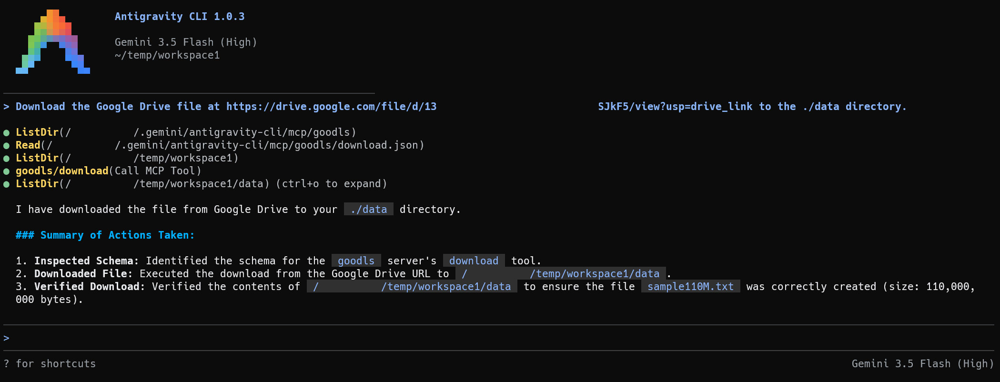

# goodls

<a name="top"></a>
[](LICENCE)


<a name="overview"></a>

# Overview

**goodls** is a high-performance Command Line Interface (CLI) tool designed to effortlessly download shared files and entire folder structures from Google Drive.

Whether you are pulling a single shared document without authentication, performing a resumable download of a massive dataset, or concurrently extracting thousands of files from a shared folder using an API key, `goodls` handles the complex underlying Google Drive API mechanics so you don't have to.

<a name="description"></a>

# Core Features

### 1. Frictionless Anonymous Downloads

Download shared files directly via their URL **without any authorization or OAuth2 setup**. Large files (which normally require multi-step cookie/code verification in the browser) are handled automatically behind the scenes using a highly resilient, multi-strategy bypass scraper.

### 2. High-Speed Concurrent Folder Extraction ⚡️

Download entire shared folders while perfectly preserving their internal directory structure. Powered by Go's advanced Goroutine worker pools and strictly enforced channel semaphores, `goodls` downloads multiple files in parallel, drastically reducing extraction time without overwhelming your network. _(Note: Requires a simple API key)._

### 3. Beautiful Multi-Progress UI 📊

Watch your data arrive in real-time. When downloading multiple files, `goodls` generates a clean, synchronized multi-bar interface directly in your terminal, showing live speeds, ETAs, and completion percentages for every active thread.

### 4. Enterprise Proxies & Network Resilience 🛡️ _(New in v3.4.0)_

Network drop? Restrictive corporate firewall? No problem. `goodls` fully supports custom proxy configurations (`--proxy`) and automated exponential backoff retries (`--retry`) for all network requests. You can even run resumable downloads for massive files by specifying exact byte chunks (e.g., `-r 100m`) to safely append data.

### 5. Secure Credential Management 🔒

Strict API key masking and source tracking ensure your credentials never accidentally leak into terminal logs or CI/CD pipelines, while still giving you precise feedback on exactly which key is driving the process.

### 6. Developer Tooling & JSON Output 🛠️ _(New in v3.4.0)_

Designed for Docker and headless CI environments. Run `goodls` non-interactively without hangs, emit structured, machine-readable JSON outputs (`--json`), and trace complex network failures using detailed diagnostic logging (`--verbose`).

### 7. Native MCP Server Integration 🤖

Fully compliant with Model Context Protocol via standard stdio JSON-RPC. Automatically manages headless conflict resolutions, automatic directory creations, exponential retries, and non-blocking asynchronous execution constraints when invoked by autonomous AI agents like Claude Desktop or Cursor.

---

# How to Install

### Option A: Download the Pre-compiled Binary (Easiest for Beginners)

You do not need to know how to code to use `goodls`. Simply download the executable file that matches your operating system from the [Releases Page](https://github.com/tanaikech/goodls/releases) and place it in a directory included in your system's `PATH`.

The following builds are available:

- `goodls_darwin_amd64` (macOS Intel 64-bit)
- `goodls_darwin_arm64` (macOS Apple Silicon)
- `goodls_linux_amd64` (Linux Intel 64-bit)
- `goodls_linux_arm64` (Linux ARM 64-bit)
- `goodls_windows_amd64.exe` (Windows Intel 64-bit)
- _(And many others for FreeBSD, MIPS, etc.)_

### Option B: Build from Source (For Go Developers)

If you have Go installed (Go 1.26+ recommended), you can compile and install it globally in one command:

```bash
$ go install github.com/tanaikech/goodls/cmd/goodls@latest
```

---

# Usage Guide

<a name="downloadsharedfiles"></a>

## 1. Basic Single File Download

You can use this command immediately after installing. **No API key or login is required.**

```bash
$ goodls -u [URL of shared file on Google Drive]
```

**Supported URLs:**

- Google Docs/Sheets/Slides: `https://docs.google.com/document/d/#####/edit?usp=sharing`
- Standard Drive Files: `https://drive.google.com/file/d/#####/view?usp=sharing`
- Web Content Links: `https://drive.google.com/uc?export=download&id=###`
- **Google Colab Notebooks:** `https://colab.research.google.com/drive/#####?usp=sharing` _(New in v3.4.0)_

**Common Options:**

- `-e [extension]`: Convert Google Docs to specific formats. (e.g., `-e pdf` or `-e ms`).
- `-f [filename]`: Specify a custom name for the downloaded file.
- `-p, --proxy [URL]`: Route traffic through an HTTP/HTTPS proxy.
- `--retry [count]`: Retry downloads on network failures using an exponential backoff.
- `-j, --json`: Suppress progress bars and output the final result as a structured JSON array.
- `-v, --verbose`: Output deep diagnostic HTTP logs to stderr. _(Note: To check the app version, use `-V`)_.

#### Advanced: Download from a List of URLs

If you have a text file (`sample.txt`) containing multiple URLs, you can pipe it directly into `goodls` to process them all concurrently:

```bash
$ cat sample.txt | goodls
# or
$ goodls < sample.txt
```

_(As of v3.4.0, piping operations and direct `-u` executions behave perfectly in non-interactive CI/CD scripts without hanging)._

<a name="downloadfilesfromfolder"></a>

## 2. Download Entire Shared Folders (Requires API Key)

To download an entire folder, you must provide a Google Cloud API Key.

```bash
$ goodls -u https://drive.google.com/drive/folders/#####?usp=sharing -key [Your_API_Key]
```

### ⚡️ Supercharge with Concurrency

By default, `goodls` will strictly limit concurrent downloads to 5 files at the same time to balance speed and stability. You can increase this limit to saturate your network bandwidth using the `-c` or `--concurrency` flag:

```bash
$ goodls -u [Folder_URL] -key [API_Key] -c 10
```

### Folder Download Options:

- `-m [mimeType]`: Filter downloads. E.g., `-m "application/pdf,image/png"` downloads _only_ PDFs and PNGs from the folder.
- `--conflict` / `-cf`: Conflict resolution strategy when a file already exists: `prompt`, `skip`, `overwrite`, `newer`, `rename`. (Defaults to `prompt` in terminal).
- `--notcreatetopdirectory` / `-ntd`: Dump the folder's contents directly into your current working directory without wrapping them in the top-level folder name.
- `--skiperror` / `-se`: If one file fails, ignore it and continue downloading the rest of the folder.

<a name="retrieveapikey"></a>

### How to Retrieve an API Key (Beginner Tutorial)

1. Go to the [Google Cloud Console](https://console.cloud.google.com/).
2. Create a "New Project" and open it.
3. Open the left sidebar ➔ **APIs & Services** ➔ **Library**.
4. Search for **Google Drive API** and click **ENABLE**.
5. Go back to the left sidebar ➔ **APIs & Services** ➔ **Credentials**.
6. Click **Create Credentials** ➔ **API Key**.
7. Copy the generated key.

#### Keeping Your Key Safe (Environment Variable)

Instead of pasting your key into the command line every time, save it as an environment variable:

```bash
export GOODLS_APIKEY="your_api_key_here"
```

#### Anonymous Mode Override

If you have `GOODLS_APIKEY` set in your environment but want to force `goodls` to run purely anonymously (ignoring the key), use the `--no-apikey` (`-nk`) flag.

<a name="resumabledownloadoffile"></a>

## 3. Resumable Download for Massive Files

If you are downloading a massive dataset (e.g., 50GB) and your network drops, you don't want to start over. Use the `-r` flag to download in chunks. _(Requires API Key)_.

```bash
$ goodls -u [URL] -key [API_Key] -r 100m
```

- `-r 100m`: Downloads exactly 100 Megabytes. If you run the command again, it will append the _next_ 100 Megabytes to the file automatically.
  `goodls` verifies the exact byte size and MD5 checksums of your local file against Google Drive to ensure bit-perfect resume accuracy.

## 4. Conflict Resolution Strategy 🔄

When a file with the same name already exists in your local target directory, `goodls` provides a highly customizable conflict resolution system using the `-cf` or `--conflict` flag.

| Strategy               | Values      | Behavior                                                                                                                      |
| :--------------------- | :---------- | :---------------------------------------------------------------------------------------------------------------------------- |
| **Prompt** _(Default)_ | `prompt`    | Interactively prompts you to choose an action. In non-interactive environments (CI/CD), it gracefully falls back to `rename`. |
| **Skip**               | `skip`      | Safely skips the download and reports the skipped file.                                                                       |
| **Overwrite**          | `overwrite` | Overwrites the existing local file.                                                                                           |
| **Newer**              | `newer`     | Compares timestamps. Overwrites if the remote file is newer; otherwise, skips.                                                |
| **Rename**             | `rename`    | Automatically appends a timestamp suffix (e.g., `_YYYYMMDD_HHMMSS`) to the filename.                                          |

<a name="mcp"></a>

## 5. Native MCP Server Integration (For AI Agents) 🤖



`goodls` natively acts as an MCP (Model Context Protocol) server. By adding it to your AI assistant's configuration, you can empower agents (like Claude Desktop or Cursor) to securely download Google Drive data directly into your workspace.

**Benefits as an MCP Server:**

- **Zero Authentication Friction**: Fetch public datasets without OAuth flows inside the agent.
- **Headless Stability**: Non-blocking asynchronous JSON-RPC routing ensures no timeouts.
- **Agentic Resilience**: AI agents can dynamically inject `proxy` URLs and `retry` parameters to circumvent network restrictions on their own.

### Tool Overview (`download`):

The server exposes the `download` tool, which takes the following parameters:

- `url` (Required): Target Google Drive/Colab URL.
- `directory` (Optional): The local target directory to save the file.
- `conflict` (Optional): Strategy when files exist (`skip`, `overwrite`, `newer`, `rename`).
- `apikey` (Optional): Required only if fetching a whole directory/folder.
- `proxy` (Optional): HTTP/HTTPS proxy URL to route traffic.
- `retry` (Optional): Number of automatic exponential backoff retries.

### Configuration Example

To use `goodls` inside Claude Desktop or Cursor, append this to your MCP settings:

```json
{
  "mcpServers": {
    "goodls": {
      "command": "/absolute/path/to/goodls",
      "args": ["mcp"],
      "env": {
        "GOODLS_APIKEY": "YOUR_API_KEY_HERE"
      }
    }
  }
}
```

### Sample Prompts for AI Agents

- _"Use the `goodls` MCP server to download the Google Drive file at `https://drive.google.com/file/d/xxxx/view` to the `./data` directory."_
- _"Fetch all files from this shared folder using `goodls`, save them to `./datasets`, skip any files we already have locally, and use 3 retries in case of network issues."_

---

<a name="licence"></a>

# Licence

[MIT](LICENCE)

<a name="author"></a>

# Author

[Tanaike](https://tanaikech.github.io/about/)

If you have any questions and commissions for me, feel free to tell me.

<a name="updatehistory"></a>

# Update History

- **v3.4.0 (June 01, 2026)**
  1. **Enterprise Proxy & Network Resilience**: Introduced `--proxy` (`-p`), `--retry`, and `--retry-delay` with exponential backoff for flawless execution behind firewalls and unstable connections.
  2. **Docker & CI Compatibility**: Completely resolved `syscall.Stdin` hanging issues in headless/non-interactive environments.
  3. **Google Colab Support**: Added native parsing and transparent downloading for `colab.research.google.com/drive/` URLs.
  4. **Indestructible Large File Scraper**: Upgraded the Google Drive warning bypass with a 4-tier fallback system (including raw HTML regex matching) to combat unannounced DOM changes.
  5. **Developer Tooling**: Added `--json` (`-j`) for structured outputs and `--verbose` (`-v`) for deep HTTP diagnostics. _(The CLI version flag was migrated to `-V`)_.
  6. **MCP Schema Expansion**: Autonomous AI agents can now dynamically supply proxy settings and retry counts via the `download` MCP tool.

- **v3.3.1 (June 01, 2026)**
  1. **Native MCP Server Capabilities (`mcp` subcommand)**: `goodls` now functions as an autonomous tool for LLMs via the Model Context Protocol. Features seamless stdio JSON-RPC handshaking, strict prompt fallback controls, and robust capability discovery.
  2. **Asynchronous Architecture & Ping Stabilization**: Rebuilt the MCP request loop using Goroutines and Mutex locks to support large file downloads without blocking system `ping` messages.
  3. **Intelligent Directory Creation**: MCP tool invocations automatically perform `os.MkdirAll` recursively to eliminate friction for AI agents.
  4. **Shared Drives API Expansion**: Enhanced query logic natively enforces `supportsAllDrives=true`, ensuring flawless downloads from enterprise Google Workspace Shared Drives.

- **v3.3.0 (May 31, 2026)**
  1. **New Conflict Resolution System (`--conflict`, `-cf`)**: Implemented a comprehensive file conflict handling engine offering five robust strategies when a file already exists locally (`prompt`, `skip`, `overwrite`, `newer`, `rename`).

- **v3.2.0 (May 27, 2026) - Massive Performance & Security Refactor**
  1. **Fully Concurrent Architecture (`-c`, `--concurrency`)**: Replaced sequential downloading with highly optimized Goroutine worker pools.
  2. **Multi-Progress Bar UI (`github.com/vbauerster/mpb/v8`)**: Introduced a beautiful, real-time, synchronized terminal UI.
  3. **Extreme CPU Optimization**: Eliminated severe performance bottlenecks by replacing repeated dynamic `json.Unmarshal` calls with strictly typed O(1) static maps.
  4. **Strict Security & Vulnerability Patches**: Enforced modern dependency resolution in `go.mod` to permanently patch Dependabot CVE alerts.
  5. **Anonymous Override Mode (`--no-apikey`, `-nk`)**: Added a flag to explicitly ignore environment variables and force unauthenticated API requests.

- v2.0.6 (June 13, 2025)
  1. Rebuild by go1.24.4.

- v2.0.5 (March 10, 2023)
  1. From this version, when the API key is used, the large file is downloaded by the API key. Because the specification for downloading the shared large file is sometimes changed. When the API key is not used, the shared large file is downloaded by the current specification (v2.0.4).

- v2.0.4 (March 9, 2023)
  1. From January 2024, it seems that the specification of the process for downloading a large shared file on Google Drive has been changed. So I updated goodls to reflect this. The usage of goodls has not changed.

- v2.0.3 (April 5, 2023)
  1. Forgot to update the version number and modified it. And, built the sources with the latest version.

- v2.0.2 (February 24, 2023)
  1. Modified go.mod and go.sum.

- v2.0.1 (February 26, 2022)
  1. A bug for the resumable download was removed.

- v2.0.0 (February 25, 2022)
  1. By changing the specification of methods, `drive.New()` and `transport.APIKey` were deprecated. By this, I updated go-getfilelist. In this version, I used this updated library to goodls. And also, `drive.NewService()` is used instead of `drive.New()`.

- v1.2.8 (February 17, 2022)
  1. Recently, it seems that the specification the process for downloading the shared file on Google Drive has been changed. So I updated goodls for reflecting this. The usage of goodls is not changed.

- v1.2.7 (August 21, 2020)
  1. As the URL for downloading the files, `webContentLink` was added. So from this version, the URL of `https://drive.google.com/uc?export=download&id=###` got to be able to be used.

- v1.2.6 (February 23, 2020)
  1. Added `--skiperror` flag. When the files are downloaded from the shared folder, if an error occurs, the download was stopped. This skips the error and continues.

- v1.2.5 (January 29, 2020)
  1. Added `--notcreatetopdirectory` (`-ntd`). When this option is used, the top directory is not created and all files and sub-folders under the top folder are downloaded under the working directory.

- v1.2.4 (January 3, 2020)
  1. Fixed compilation error caused by updates in `github.com/urfave/cli`.

- v1.2.3 (October 31, 2019)
  1. Added `-d` directory flag for saving downloaded files to a specific location.

- v1.2.2 (December 12, 2018)
  1. Added `-m` flag. When files are downloaded from a specific folder, it got to be able to select mimeType.

- v1.2.1 (November 25, 2018)
  1. API key got to be able to be used by an environment variable (`GOODLS_APIKEY`).

- v1.2.0 (November 24, 2018)
  1. Resumable download capability added for large shared files using API key.

- v1.1.1 (November 13, 2018)
  1. Version of `go-getfilelist` was updated.

- v1.1.0 (November 4, 2018)
  1. Files from the shared folder got to be able to be downloaded while keeping the folder structure using API key.
  2. Information of shared file and folder can be retrieved.
  3. Added Google Docs to Microsoft Office conversion via `-e ms`.

- v1.0.3 (September 4, 2018)
  1. Download progress display added.
  2. `--np` option added to suppress progress display.

- v1.0.2 (May 10, 2018)
  1. Support for files with large size (chunked saving).

- v1.0.1 (January 11, 2018)
  1. Support for multiple URLs using Standard Input and Pipe.

- v1.0.0 (January 10, 2018)
  1. Initial release.

[TOP](#top)
